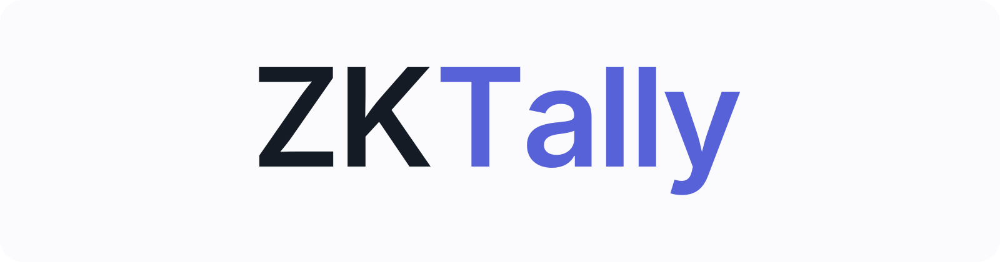
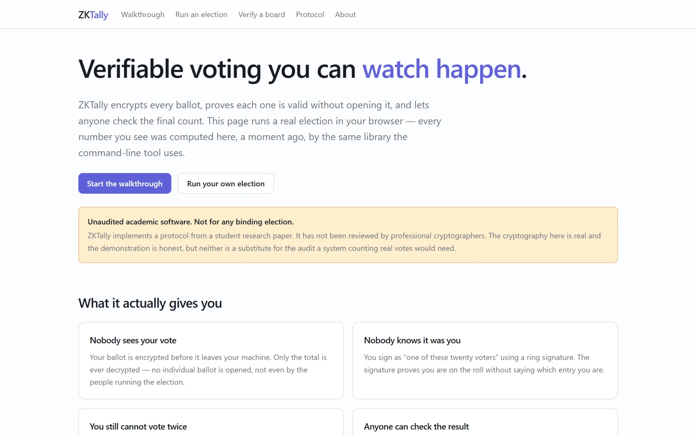
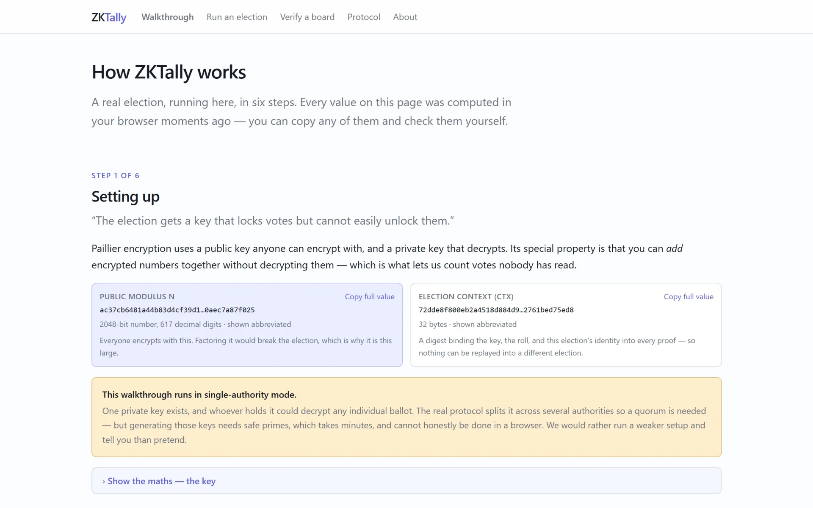
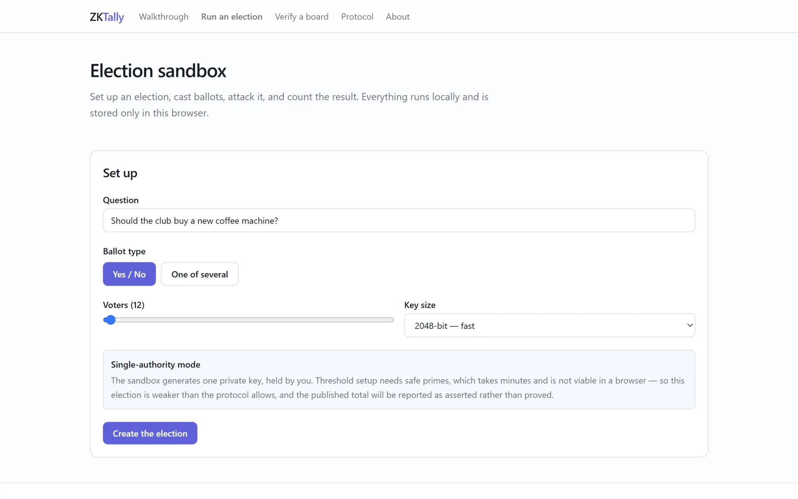
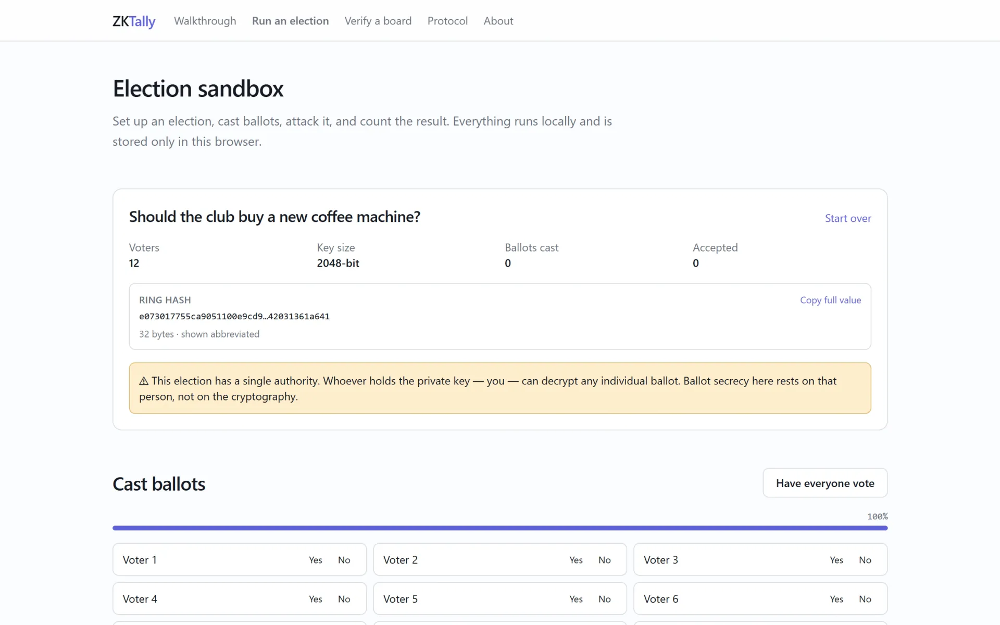
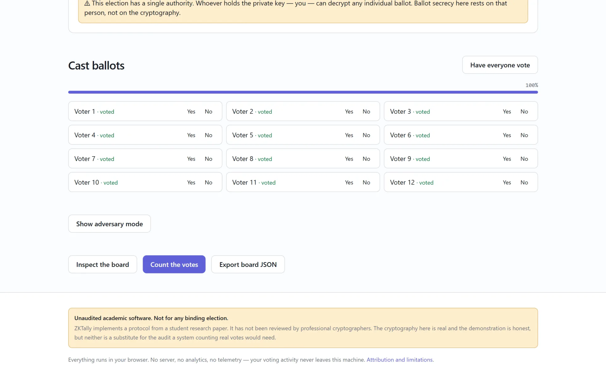
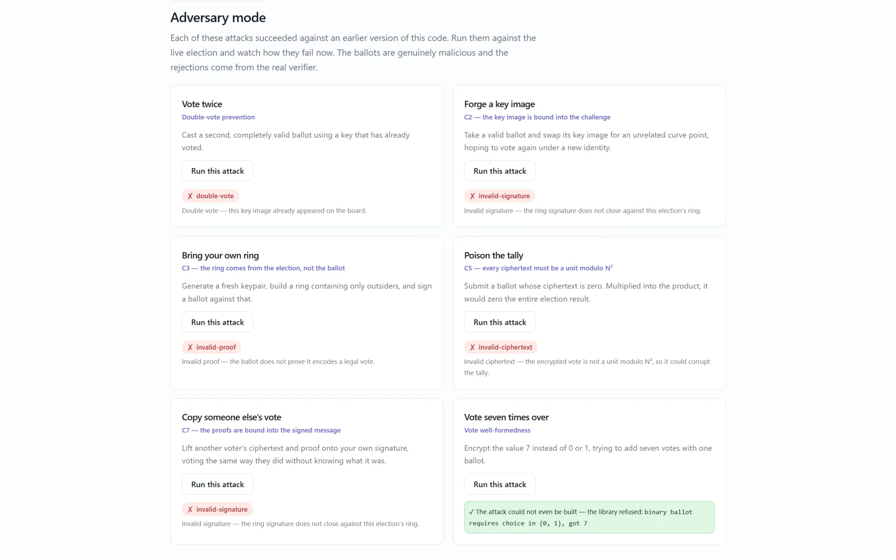
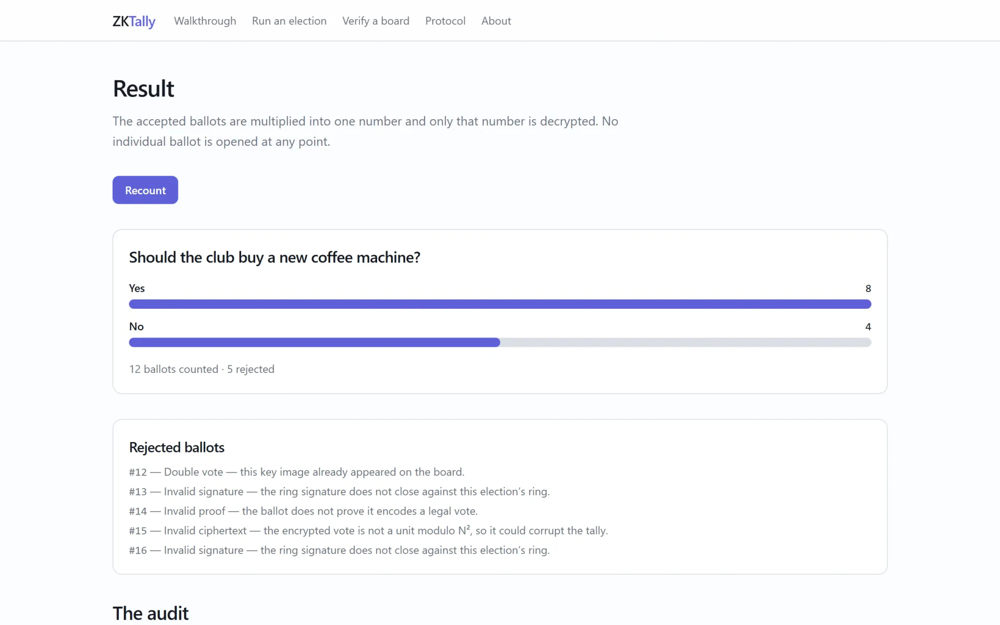
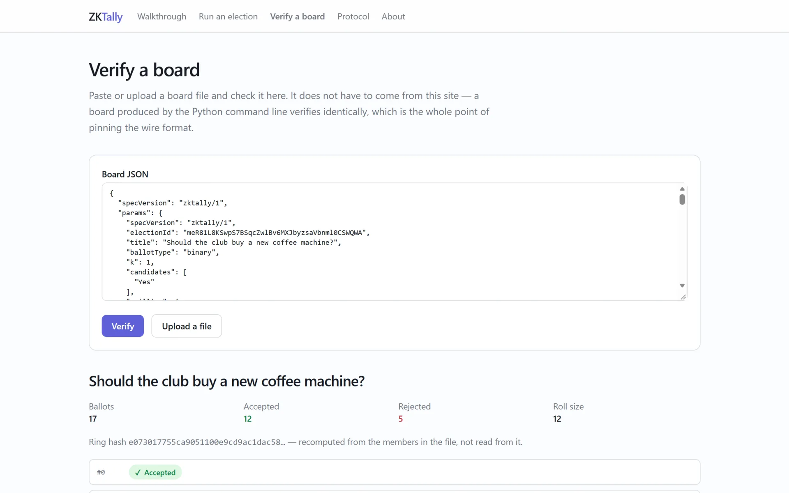

# 🗳️ ZKTally

**Verifiable voting you can watch happen**

Privacy-preserving, anonymously verifiable e-voting from linkable ring signatures, Paillier homomorphic encryption, and NIZK vote-correctness proofs.

---

## 🎬 Demo

  
   
  ▶ Click to watch the full demo on Google Drive

---

## 🔍 What is ZKTally?

**ZKTally** is an e-voting protocol in which no one ever opens an individual ballot, yet anyone
can check the count. A ballot is three things travelling together: an encrypted vote, a proof that
the vote is legal, and a ring signature proving the caster is on the roll. Tallying multiplies the
ciphertexts and decrypts only the total, and a deterministic key image still makes a second ballot
from the same key detectable.

The protocol ships as a Python reference implementation with a `zktally` command line, a
wire-compatible TypeScript port for the browser and Node, and an interactive explainer that runs a
real election in your browser. Both implementations share one wire format (`zktally/1`) and one
corpus of test vectors, so a ballot cast in the browser verifies in Python. ZKTally is
**unaudited academic software** and must not be used for any binding election.

### 🎯 Built for

ZKTally was built for the **II4021-24 Cryptography** course at **STEI ITB**.

---

## ❓ Problem → 💡 Solution

| ❓ Problem | 💡 How ZKTally solves it |
|---|---|
| **Secret ballots hide the count** — if no one may see a vote, there is nothing for voters to check the result against. | **Homomorphic tallying** — Paillier ciphertexts are multiplied into one number and only that aggregate is decrypted, so the total is computed without opening a single ballot. |
| **An encrypted vote can be anything** — a ciphertext of 7 instead of 0 or 1 would add seven votes at once, and nobody can see it. | **NIZK OR-proofs** — every ballot proves its plaintext is a legal vote (binary, or exactly one of *k*) without revealing which. |
| **Anonymity invites double voting** — if the signer is hidden, a voter could cast twice unnoticed. | **Linkable ring signatures** — the caster proves they are *some* registered voter, and the deterministic key image flags any second ballot from the same key. |
| **Verification usually means trusting the authority** — the auditor needs the keys the auditor is meant to check. | **Secret-free audit** — `zktally audit` re-verifies every ballot and partial decryption from public data alone; threshold mode makes the tally itself verifiable. |

---

## 📸 Screenshots

<table>
<tr>
<td width="50%" align="center"><b>Landing — verifiable voting you can watch</b>  </td>
<td width="50%" align="center"><b>Walkthrough — setting up the Paillier key</b>  </td>
</tr>
<tr>
<td width="50%" align="center"><b>Election sandbox — setup</b>  </td>
<td width="50%" align="center"><b>Election created — ring hash and authority warning</b>  </td>
</tr>
<tr>
<td width="50%" align="center"><b>Every voter cast a ballot</b>  </td>
<td width="50%" align="center"><b>Adversary mode — six attacks, all rejected</b>  </td>
</tr>
<tr>
<td width="50%" align="center"><b>Result — tally and rejected ballots</b>  </td>
<td width="50%" align="center"><b>Verify a board — paste any board JSON</b>  </td>
</tr>
</table>

---

## 📦 Repositories

| Repository | Description | Tech Stack | Deployment |
|---|---|---|---|
| [**ZKTally**](https://github.com/ZKTally/ZKTally) | Python reference implementation and the `zktally` command line. | Python · Paillier · LSAG · secp256k1 · gmpy2 | [PyPI](https://pypi.org/project/zktally/) |
| [**zktally-js**](https://github.com/zktally/zktally-js) | TypeScript port for the browser and Node, wire-compatible with the reference. | TypeScript · @noble/curves · @noble/hashes · Web Workers · Vitest | [npm](https://www.npmjs.com/package/zktally) |
| [**zktally.github.io**](https://github.com/zktally/zktally.github.io) | Interactive explainer that runs a real election in your browser. | Vue 3 · Vite · Tailwind CSS · Pinia · Playwright | [zktally.github.io](https://zktally.github.io) |
| [**paper**](https://github.com/ZKTally/paper) | The protocol paper. | LaTeX | — |
| [**.github**](https://github.com/zktally/.github) | This organization profile and its assets. | Markdown | — |

---

© 2025 Faiz Atharrahman

